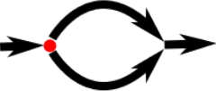
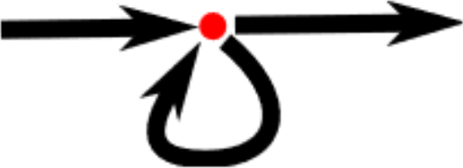

# Javascript FUNdamentals
## Control Flow

---

## JS control flow

Javascript exercutes a program from start to finish, in order. 


---

## JS control flow

We will often need a program to do things conditionally. 



---

## The `if` statement

```js
if(condition) {
    // do something
}
```

The condition **MUST** be true for the code to run.

---

## The `if` statement

Example 1:

```js
if (number > 16) {
    console.log('Hold');
}
```

Example 2:

```js
let allegiance = '';

if (forceUseGood === true) {
    allegiance = 'jedi';
} 
else {
    allegiance = 'dark side';
}
```

---

## Exercises (5 minutes);

```js
// 1. If it rains, I stay home.
const currentWeather = 'rainy';

// 2. If I am hungry, I eat.
const hunger = true;

// 3. If it's 10pm, I go to bed. If not, I write code.
const currentHour = 22;
```

---

## Problem

Here is a program that outputs all the even nubmers between 0 and 10:

```js
console.log(0);
console.log(2);
console.log(4);
console.log(6);
console.log(8);
console.log(10);
```

This is tedious but manageable...

_What if we wanted to output all of the even number between 0 and 1000?_

---

## Solution: loops!

This is where loops come in!



---

## The while loop

Output all the even numbers between 0 and 1000: 

1. `number` is set to 0.
2. `while` the loop condition is `true`, i.e. `(number < 1000)`:
    1. Outputs the `number`.
    2. Adds 2 to the `number`.
3. `number` is now 2.
4. repeats until `number` is 1002.

```js
let number = 0;

while(number <= 1000) {
   console.log(number);
   number = number + 2;
}
```

---

## Exercise

Write a `while` loop that outputs 2 to the power of 10.

```js
// 🦗
```

---

## The while loop

`while` is a great tool for some situations, but it can be a little tedious.

We need to:

1. Define a counter.

2. Define a condition for the loop to run.

3. Increment the counter everytime the loop runs.

```js
let number = 0;

while (number <= 1000) {
    console.log(number);
    number = number + 2;
}
```

---

## The for loop

Lets convert that last example from a `while` loop to a `for` loop:

```js
let number = 0;

while (number <= 1000) {
    console.log(number);
    number = number + 2;
}
```

Becomes:

```js
for (let i = 0; i <= 1000; i = i + 2) {
    console.log(i);
}
```

---

## Breakout out of loops

⚠️ The only way to break out of a loop is for the condition to be false. ⚠️

- If you write a loop that always evaluates to true, your loop will continue forever.
- This is a bad thing... it will crash your environment and can cause damage to your computer.
- To fix it, you will need to force-quit the environment:
    - `CTRL + C` usually does the trick (in the terminal).
    - `CMD + C` on MAC.

---

## Exercises!

```js
// Exercise 1
// Write a program that output all of the numbers from 0 to 25.

// Exercise 2
// Write a program that output all of ODD the numbers from 0 to 25.

// Exercise 3
// Write a program that output all of the numbers from 0 to 25,
// but replaces all multipes of `5` by the phrase `five alive!`
```
